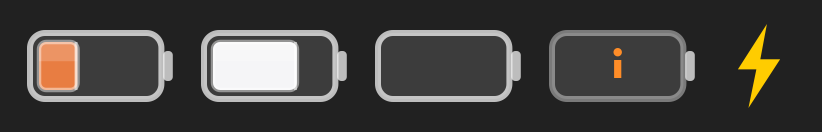

# LimitBar

A tiny macOS menu bar app that shows your remaining AI‑provider quota at a glance — as
horizontal "battery" gauges — plus a bolt that lights up while local sessions are burning tokens.



It runs as a background agent (no Dock icon, no window): the entire UI is the status‑bar item and
a small pop‑over.

## What it shows

- **Battery gauges**, one per provider, colored by brand (Claude = orange, Codex/OpenAI = white,
  OpenRouter = black, Gemini = blue). The fill is your *remaining* quota on the most‑constrained
  window — full battery = lots left.
- A **bolt** that pulses when any local session is actively processing tokens, with a live
  tokens‑per‑minute readout in the pop‑over.
- A **pop‑over** with exact per‑window percentages, reset times, and live throughput.
- **Provider selection** and a **Keychain privacy switch** in Settings.

## Requirements

- macOS 14 (Sonoma) or later
- A Swift toolchain — either [Xcode](https://developer.apple.com/xcode/) or the
  [Swift toolchain](https://www.swift.org/install/) (`swift --version` should work)

## Install

LimitBar is distributed as source; you build it locally.

```sh
git clone https://github.com/MichaelMares/LimitBar.git
cd LimitBar
./scripts/bundle.sh          # builds a release LimitBar.app and signs it
cp -R LimitBar.app /Applications/   # optional: install to /Applications
open /Applications/LimitBar.app
```

`bundle.sh` signs the app with a **stable, self‑signed certificate** it creates once in your login
Keychain (named `LimitBar Self-Signed`), giving the app a consistent code identity across rebuilds.
To skip this and use throwaway ad‑hoc signing instead, run `LIMITBAR_ADHOC=1 ./scripts/bundle.sh`.

> [!NOTE]
> The app is signed but **not notarized**, so Gatekeeper won't auto‑approve a downloaded copy.
> A build you produce locally isn't quarantined and just opens. If macOS ever blocks it, right‑click
> the app → **Open**, or allow it under **System Settings → Privacy & Security**.

## Setting up providers (credentials)

LimitBar **reads existing credentials that the official CLIs already store** — it never logs you in,
writes, or refreshes tokens. So "setup" usually just means signing in with the relevant CLI once. A
provider only appears once its credentials are detected; toggle which ones show in **Settings**.

| Provider | How to authenticate | Where LimitBar reads it |
|---|---|---|
| **Claude** | Sign in with [Claude Code](https://claude.com/claude-code): run `claude` once | macOS Keychain item `Claude Code-credentials` |
| **Codex** | Sign in with the Codex CLI: run `codex` once | `~/.codex/auth.json` (falls back to local session logs offline) |
| **Gemini** | Sign in with the [Gemini CLI](https://github.com/google-gemini/gemini-cli): run `gemini` once | `~/.gemini/oauth_creds.json` |
| **OpenRouter** | Set an API key (see below) | `OPENROUTER_KEY` env var, or `~/.zshenv` |

### OpenRouter API key

OpenRouter uses a plain API key rather than a CLI login. Create one at
**https://openrouter.ai/keys**, then make it available to LimitBar in either way:

```sh
# Persist it for GUI-launched apps too (LimitBar reads ~/.zshenv when launched from Finder):
echo 'export OPENROUTER_KEY="sk-or-..."' >> ~/.zshenv
```

Keep real keys out of version control. The key is sent only to `openrouter.ai` to read your
credit balance.

If a token has expired, LimitBar shows an error on that gauge telling you which CLI to run — by
design it won't refresh the token for you (that would invalidate the CLI's own session).

## Privacy & security

- **Read‑only.** LimitBar only *reads* credentials the CLIs already created; it never writes,
  rotates, or stores them.
- **No third parties.** Tokens are sent only to each provider's own endpoint to fetch usage —
  `api.anthropic.com`, `chatgpt.com`, `cloudcode-pa.googleapis.com`, `openrouter.ai`. There is no
  analytics, telemetry, or backend of LimitBar's own.
- **Revoke anytime.** In **Settings → Keychain access**, turn off Keychain reading entirely —
  LimitBar then never touches it. (This in-app switch is the real off button: LimitBar reads the
  Claude item through Apple's `security` tool, so removing LimitBar from the item's ACL in Keychain
  Access alone won't stop it.)
- All file access is under your home directory, resolved at runtime — no hard‑coded paths.

## Development

```sh
swift build                                                   # debug build
./.build/debug/LimitBar --check claude,codex,openrouter,gemini,live   # one-shot fetch, prints to stdout
./.build/debug/LimitBar --render-bar /tmp/preview.png         # render the menu bar artwork to a PNG
```

`--check` is the easiest way to test provider logic without launching the GUI.

Architecture notes and the steps to add a new provider live in [CLAUDE.md](CLAUDE.md).

## License

[MIT](LICENSE) © Michael Mares
